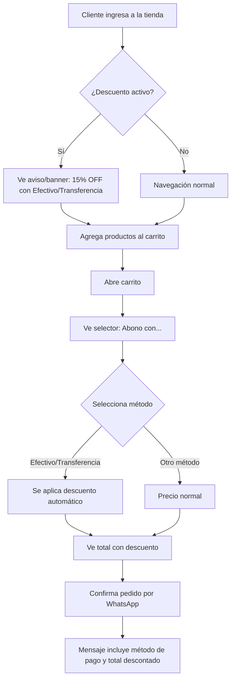
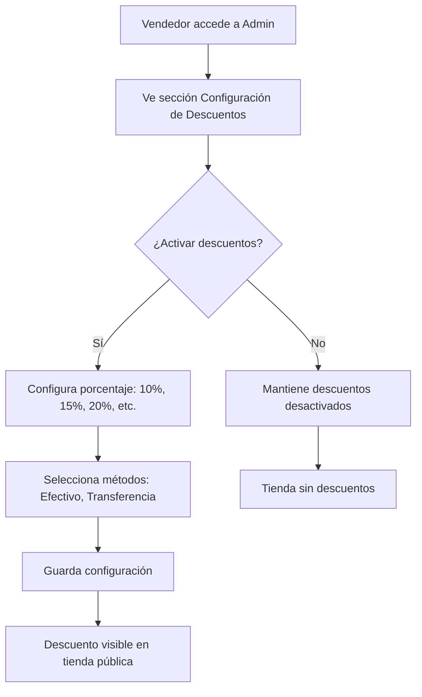

# Plan de Implementación: Descuentos por Método de Pago

## Resumen

Implementar un sistema de descuentos por método de pago (Efectivo/Transferencia) que permita a los vendedores configurar un porcentaje de descuento global para su tienda, visible para el cliente mediante avisos y aplicable en el carrito antes de confirmar el pedido.

---

## Flujo de Usuario

### Cliente (Frontend Público)



### Vendedor (Admin)



---

## Arquitectura Técnica

### Estructura de Archivos

```
src/
├── modules/
│   └── discounts/
│       ├── index.js                    # Exportaciones principales
│       ├── discounts.config.js         # Configuración constante
│       ├── hooks/
│       │   └── useDiscounts.js         # Hook para manejar descuentos
│       └── components/
│           ├── DiscountBanner.jsx      # Banner informativo en tienda
│           ├── PaymentMethodSelector.jsx # Selector en carrito
│           └── DiscountBadge.jsx       # Badge opcional para productos
├── components/
│   └── CartModal.jsx                   # MODIFICAR: Integrar selector
├── pages/
│   └── admin/
│       └── StoreSettings.jsx           # MODIFICAR: Agregar sección descuentos
└── services/
    └── supabase.js                     # Ya existe

sql/
└── 29_add_discount_settings.sql        # NUEVO: Migración BD
```

---

## Base de Datos

### Migración: `sql/29_add_discount_settings.sql`

```sql
-- ============================================
-- Migración: Agregar configuración de descuentos por método de pago
-- Fecha: 2026-02-19
-- ============================================

-- Agregar columna JSONB para configuración de descuentos
ALTER TABLE stores 
ADD COLUMN IF NOT EXISTS discount_settings JSONB DEFAULT NULL;

-- Estructura esperada del JSON:
-- {
--   "enabled": true,
--   "cash_discount": 15,
--   "transfer_discount": 15,
--   "show_banner": true
-- }

-- Comentario documental
COMMENT ON COLUMN stores.discount_settings IS 
'Configuración de descuentos por método de pago. JSONB con estructura: enabled, cash_discount, transfer_discount, show_banner';

-- Índice para consultas eficientes
CREATE INDEX IF NOT EXISTS idx_stores_discount_settings 
ON stores USING GIN (discount_settings) 
WHERE discount_settings IS NOT NULL;
```

---

## Componentes a Crear

### 1. `src/modules/discounts/discounts.config.js`

```javascript
// Configuración de métodos de pago disponibles
export const PAYMENT_METHODS = {
  CASH: 'cash',
  TRANSFER: 'transfer',
  OTHER: 'other'
};

// Etiquetas para UI
export const PAYMENT_LABELS = {
  [PAYMENT_METHODS.CASH]: 'Efectivo',
  [PAYMENT_METHODS.TRANSFER]: 'Transferencia Bancaria',
  [PAYMENT_METHODS.OTHER]: 'Otro método'
};

// Porcentajes predefinidos para selector
export const DISCOUNT_OPTIONS = [0, 5, 10, 15, 20, 25, 30];

// Valores por defecto
export const DEFAULT_DISCOUNT_SETTINGS = {
  enabled: false,
  cash_discount: 0,
  transfer_discount: 0,
  show_banner: true
};
```

### 2. `src/modules/discounts/hooks/useDiscounts.js`

```javascript
import { useState, useEffect } from 'react';
import { supabase } from '../../../services/supabase';
import { DEFAULT_DISCOUNT_SETTINGS } from '../discounts.config';

/**
 * Hook para manejar configuración de descuentos de una tienda
 * @param {string} storeSlug - Slug de la tienda
 * @returns {object} - { discountSettings, loading, error, updateSettings }
 */
export const useDiscounts = (storeSlug) => {
  const [discountSettings, setDiscountSettings] = useState(DEFAULT_DISCOUNT_SETTINGS);
  const [loading, setLoading] = useState(true);
  const [error, setError] = useState(null);

  // Cargar configuración
  useEffect(() => {
    const fetchDiscountSettings = async () => {
      if (!storeSlug) {
        setLoading(false);
        return;
      }

      try {
        const { data, error: fetchError } = await supabase
          .from('stores')
          .select('discount_settings')
          .eq('store_slug', storeSlug)
          .single();

        if (fetchError) throw fetchError;

        if (data?.discount_settings) {
          setDiscountSettings({ ...DEFAULT_DISCOUNT_SETTINGS, ...data.discount_settings });
        }
      } catch (err) {
        setError(err.message);
      } finally {
        setLoading(false);
      }
    };

    fetchDiscountSettings();
  }, [storeSlug]);

  // Función para calcular descuento
  const calculateDiscount = (total, paymentMethod) => {
    if (!discountSettings.enabled) return 0;

    let discountPercent = 0;
    if (paymentMethod === 'cash') {
      discountPercent = discountSettings.cash_discount || 0;
    } else if (paymentMethod === 'transfer') {
      discountPercent = discountSettings.transfer_discount || 0;
    }

    return total * (discountPercent / 100);
  };

  return {
    discountSettings,
    loading,
    error,
    calculateDiscount
  };
};
```

### 3. `src/modules/discounts/components/DiscountBanner.jsx`

```javascript
import React from 'react';
import { FaTag } from 'react-icons/fa';
import './DiscountBanner.css';

/**
 * Banner informativo de descuentos para mostrar en la tienda pública
 */
const DiscountBanner = ({ discountSettings }) => {
  if (!discountSettings?.enabled || !discountSettings?.show_banner) {
    return null;
  }

  const discounts = [];
  if (discountSettings.cash_discount > 0) {
    discounts.push(`${discountSettings.cash_discount}% en Efectivo`);
  }
  if (discountSettings.transfer_discount > 0) {
    discounts.push(`${discountSettings.transfer_discount}% por Transferencia`);
  }

  if (discounts.length === 0) return null;

  return (
    <div className="discount-banner">
      <FaTag className="discount-banner__icon" />
      <span className="discount-banner__text">
        <strong>¡DESCUENTO!</strong> Pagando con {discounts.join(' o ')}
      </span>
    </div>
  );
};

export default DiscountBanner;
```

### 4. `src/modules/discounts/components/PaymentMethodSelector.jsx`

```javascript
import React from 'react';
import { FaMoneyBillWave, FaUniversity, FaCreditCard } from 'react-icons/fa';
import { PAYMENT_METHODS, PAYMENT_LABELS } from '../discounts.config';
import './PaymentMethodSelector.css';

/**
 * Selector de método de pago para el carrito
 */
const PaymentMethodSelector = ({ 
  discountSettings, 
  selectedMethod, 
  onMethodChange 
}) => {
  if (!discountSettings?.enabled) {
    return null;
  }

  const methods = [
    { 
      id: PAYMENT_METHODS.CASH, 
      label: PAYMENT_LABELS[PAYMENT_METHODS.CASH], 
      discount: discountSettings.cash_discount,
      icon: FaMoneyBillWave 
    },
    { 
      id: PAYMENT_METHODS.TRANSFER, 
      label: PAYMENT_LABELS[PAYMENT_METHODS.TRANSFER], 
      discount: discountSettings.transfer_discount,
      icon: FaUniversity 
    },
    { 
      id: PAYMENT_METHODS.OTHER, 
      label: PAYMENT_LABELS[PAYMENT_METHODS.OTHER], 
      discount: 0,
      icon: FaCreditCard 
    }
  ];

  return (
    <div className="payment-method-selector">
      <h4 className="payment-method-selector__title">
        Abono con:
      </h4>
      <div className="payment-method-selector__options">
        {methods.map(method => {
          const Icon = method.icon;
          const isSelected = selectedMethod === method.id;
          const hasDiscount = method.discount > 0;

          return (
            <button
              key={method.id}
              type="button"
              className={`payment-method-option ${isSelected ? 'selected' : ''} ${hasDiscount ? 'has-discount' : ''}`}
              onClick={() => onMethodChange(method.id)}
            >
              <Icon className="payment-method-option__icon" />
              <span className="payment-method-option__label">{method.label}</span>
              {hasDiscount && (
                <span className="payment-method-option__discount">
                  -{method.discount}%
                </span>
              )}
            </button>
          );
        })}
      </div>
    </div>
  );
};

export default PaymentMethodSelector;
```

---

## Modificaciones a Archivos Existentes

### 1. `CartModal.jsx` - Integrar selector de pago y descuento

**Cambios necesarios:**
- Importar `useDiscounts` hook
- Importar `PaymentMethodSelector` component
- Agregar estado `selectedPaymentMethod`
- Mostrar selector antes del botón confirmar
- Calcular y mostrar total con descuento
- Incluir método de pago y total descontado en mensaje WhatsApp

**Ubicación aproximada del cambio:**
```javascript
// Después de línea 14, agregar imports
import { useDiscounts } from '../modules/discounts/hooks/useDiscounts';
import PaymentMethodSelector from '../modules/discounts/components/PaymentMethodSelector';

// Después de línea 15, agregar estado
const [selectedPaymentMethod, setSelectedPaymentMethod] = useState('other');

// Usar hook de descuentos
const { discountSettings, calculateDiscount } = useDiscounts(storeSlug);

// Calcular descuento
const discountAmount = calculateDiscount(total, selectedPaymentMethod);
const finalTotal = total - discountAmount;

// En el JSX, antes del botón confirmar, agregar selector
// Modificar mensaje WhatsApp para incluir método y descuento
```

### 2. `PublicLayout.jsx` o `Header.jsx` - Mostrar banner de descuento

**Cambios necesarios:**
- Importar `DiscountBanner` component
- Importar `useDiscounts` hook
- Mostrar banner si hay descuentos activos

---

## Sección Admin para Configuración

### Opción A: Nueva página `StoreSettings.jsx`

Crear una página de configuración general de la tienda que incluya:
- Información de la tienda (ya existente)
- Configuración de descuentos (nueva)

### Opción B: Agregar a `BulkPriceUpdate.jsx` o panel existente

Agregar una sección colapsable para configuración de descuentos.

**Recomendación:** Opción A - Más organizado y escalable.

---

## Estilos CSS

### `DiscountBanner.css`

```css
.discount-banner {
  display: flex;
  align-items: center;
  justify-content: center;
  gap: 0.75rem;
  padding: 0.75rem 1rem;
  background: linear-gradient(135deg, #10b981 0%, #059669 100%);
  color: white;
  font-size: 0.9rem;
  border-radius: 0.5rem;
  margin-bottom: 1rem;
  animation: pulse-subtle 2s infinite;
}

.discount-banner__icon {
  font-size: 1.2rem;
}

.discount-banner__text strong {
  font-weight: 700;
}

@keyframes pulse-subtle {
  0%, 100% { opacity: 1; }
  50% { opacity: 0.9; }
}
```

### `PaymentMethodSelector.css`

```css
.payment-method-selector {
  margin: 1rem 0;
  padding: 1rem;
  background: var(--color-surface);
  border-radius: 0.75rem;
  border: 1px solid var(--color-border);
}

.payment-method-selector__title {
  font-size: 0.95rem;
  font-weight: 600;
  margin-bottom: 0.75rem;
  color: var(--color-text-main);
}

.payment-method-selector__options {
  display: flex;
  flex-direction: column;
  gap: 0.5rem;
}

.payment-method-option {
  display: flex;
  align-items: center;
  gap: 0.75rem;
  padding: 0.75rem 1rem;
  border: 2px solid var(--color-border);
  border-radius: 0.5rem;
  background: transparent;
  cursor: pointer;
  transition: all 0.2s ease;
  width: 100%;
  text-align: left;
}

.payment-method-option:hover {
  border-color: var(--color-primary);
  background: var(--color-background);
}

.payment-method-option.selected {
  border-color: var(--color-primary);
  background: var(--color-primary);
  color: var(--color-primary-text);
}

.payment-method-option.has-discount {
  border-color: #10b981;
}

.payment-method-option.selected.has-discount {
  background: #10b981;
  border-color: #10b981;
}

.payment-method-option__icon {
  font-size: 1.25rem;
}

.payment-method-option__label {
  flex: 1;
  font-weight: 500;
}

.payment-method-option__discount {
  background: #fbbf24;
  color: #1f2937;
  padding: 0.25rem 0.5rem;
  border-radius: 0.25rem;
  font-size: 0.8rem;
  font-weight: 700;
}

.payment-method-option.selected .payment-method-option__discount {
  background: white;
  color: #10b981;
}
```

---

## Checklist de Implementación

### Fase 1: Base de Datos
- [ ] Crear migración `sql/29_add_discount_settings.sql`
- [ ] Ejecutar migración en Supabase
- [ ] Verificar columna creada correctamente

### Fase 2: Módulo de Descuentos
- [ ] Crear estructura de carpetas `src/modules/discounts/`
- [ ] Crear `discounts.config.js`
- [ ] Crear `hooks/useDiscounts.js`
- [ ] Crear `components/DiscountBanner.jsx`
- [ ] Crear `components/PaymentMethodSelector.jsx`
- [ ] Crear archivos CSS correspondientes

### Fase 3: Integración en Carrito
- [ ] Modificar `CartModal.jsx` para integrar selector
- [ ] Agregar lógica de cálculo de descuento
- [ ] Modificar mensaje WhatsApp con info de descuento

### Fase 4: Banner Informativo
- [ ] Modificar `PublicLayout.jsx` o `Header.jsx`
- [ ] Mostrar banner cuando hay descuentos activos

### Fase 5: Panel Admin
- [ ] Crear/Modificar sección de configuración en Admin
- [ ] Formulario para activar/configurar descuentos
- [ ] Guardar configuración en Supabase

### Fase 6: Testing
- [ ] Probar flujo completo como cliente
- [ ] Probar configuración como vendedor
- [ ] Verificar mensaje WhatsApp correcto
- [ ] Probar con descuentos desactivados

---

## Consideraciones Adicionales

### Seguridad
- La configuración de descuentos se guarda en `stores.discount_settings` (RLS ya implementado)
- Solo el dueño de la tienda puede modificar configuración

### Performance
- El hook `useDiscounts` hace una consulta adicional, pero es optimizable con contexto global
- Considerar cachear configuración en `StoreContext` si ya existe

### Escalabilidad
- Estructura JSONB permite agregar más métodos de pago en el futuro
- Se puede extender para descuentos por producto individual si se requiere

### UX
- El banner es sutil pero visible
- El selector en carrito es claro y muestra el ahorro
- El mensaje WhatsApp incluye toda la información necesaria

---

## Estado: PAUSADO

**Este plan está listo para revisión. Awaiting confirmation to proceed with implementation.**
