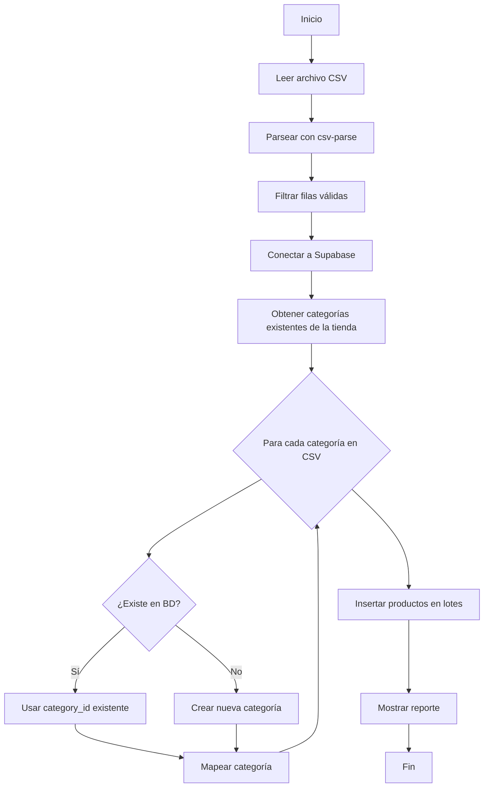

# Plan de Importación de Productos desde CSV

## 📋 Resumen

Se creará un script Node.js para importar ~144 productos desde `prod_ruwaq_edit.csv` a la tienda con `user_id: a910ac25-cc6f-485d-adc9-afba20f9966b`.

## 📊 Análisis del CSV

### Formato detectado:
- **Delimitador**: Punto y coma (`;`)
- **Columnas**: `categoria`, `nombre`, `descripcion`, `precio`
- **Productos válidos**: ~144 productos

### Categorías detectadas (12 únicas):
1. Identificadores de mascotas
2. Llaveros
3. Adornos para tortas
4. Lectura
5. Didácticos
6. Juegos
7. Flexi-juguetes
8. Luz matera
9. Calcos
10. Varios
11. Personalizados
12. Productos de apoyo y ayudas técnicas

### Problemas identificados y solución:
| Problema | Solución |
|----------|----------|
| Encoding incorrecto (caracteres corruptos) | Usar `latin1` o `win1252` al leer el archivo |
| Descripciones multilínea | El parser CSV maneja campos entre comillas |
| Descripciones vacías | Insertar como `null` o string vacío |
| Precios con valor "10" (placeholder) | Importar tal cual según indicación del usuario |
| Filas vacías al final | Filtrar filas sin nombre de producto |

## 🏗️ Arquitectura del Script



## 📝 Estructura del Script

### Archivo: `scripts/importarProductos.js`

```javascript
// Estructura principal del script
import { createClient } from '@supabase/supabase-js';
import fs from 'fs';
import { parse } from 'csv-parse/sync';

// Configuración
const USER_ID = 'a910ac25-cc6f-485d-adc9-afba20f9966b';
const CSV_PATH = '../prod_ruwaq_edit.csv';

// Funciones principales
async function main() {
    // 1. Leer y parsear CSV
    // 2. Conectar a Supabase
    // 3. Obtener/crear categorías
    // 4. Insertar productos
    // 5. Mostrar reporte
}
```

## 🔧 Requisitos

### Dependencias ya instaladas:
- `@supabase/supabase-js` - Cliente Supabase
- `csv-parse` - Parser de CSV

### Variables de entorno necesarias:
```
VITE_SUPABASE_URL=<url_del_proyecto>
VITE_SUPABASE_ANON_KEY=<clave_anon>
```

## 📦 Campos a insertar en tabla `products`

| Campo | Origen | Notas |
|-------|--------|-------|
| `name` | columna `nombre` | Requerido |
| `description` | columna `descripcion` | Puede ser vacío |
| `price` | columna `precio` | Numérico |
| `category_id` | creado/buscado | FK a categories |
| `user_id` | fijo | UUID de la tienda |
| `stock` | default 0 | No viene en CSV |
| `image_url` | null | Se carga después |

## 🚀 Comando de ejecución

```bash
# Desde la carpeta scripts
node importarProductos.js

# O desde la raíz del proyecto
node scripts/importarProductos.js
```

## ⚠️ Consideraciones importantes

1. **Idempotencia**: El script verificará si ya existen productos con el mismo nombre antes de insertar
2. **Transacciones**: Se insertarán en lotes de 50 para evitar timeouts
3. **Reporte**: Al finalizar mostrará:
   - Total de productos procesados
   - Productos insertados correctamente
   - Errores encontrados
   - Categorías creadas

## 📋 Pasos de implementación

1. [x] Analizar el archivo CSV
2. [x] Revisar la estructura de la base de datos
3. [x] Identificar los campos necesarios
4. [ ] Crear el script `importarProductos.js`
5. [ ] Probar el script
6. [ ] Ejecutar la importación
